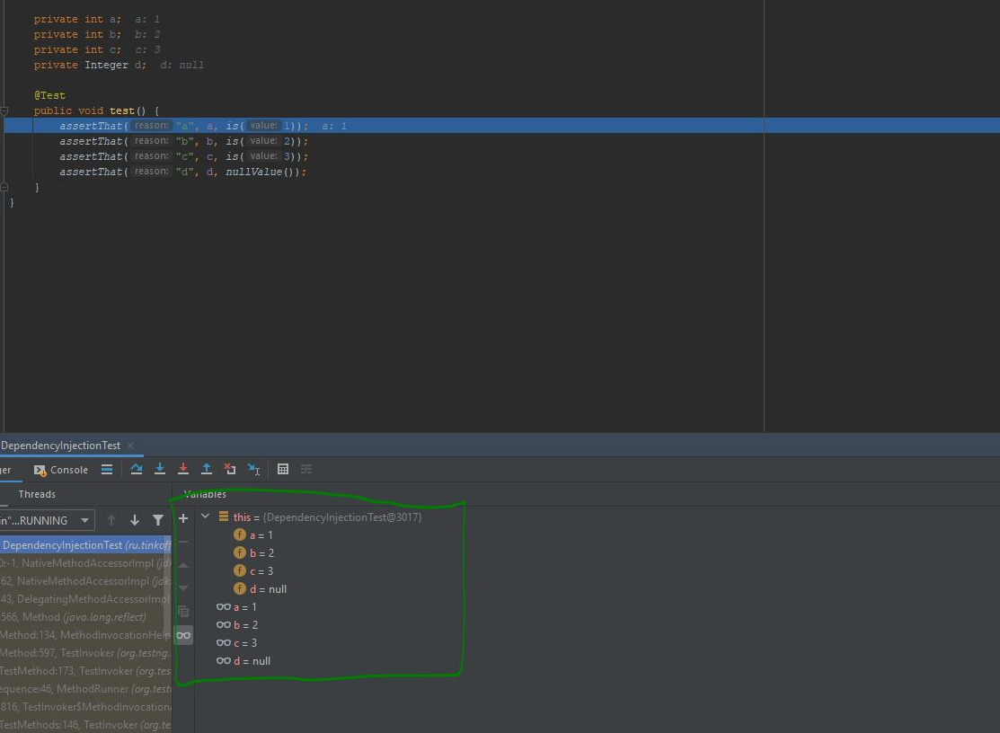

# Интеграция с JUnit5

Данный модуль предназначен для интеграции Neptune и [JUnit5](https://junit.org/junit5/docs/current/user-guide/)

## Оглавление

   - [Пишем первый тест](#Пишем-первый-тест)
   - [Настройки](#Настройки)
   - [Внедрение зависимостей](#Внедрение-зависимостей)

## Пишем первый тест

Класс, описывающий тест, должен наследоваться от `BaseJunit5Test`

```java
import org.junit.jupiter.api.Test;
import ru.tinkoff.qa.neptune.jupiter.integration.BaseJunit5Test;

public class MyTest extends BaseJunit5Test {
    
    @Test
    public test() {
      //some checks
    }
}
```

Так же можно просто использовать [механизм расширений](https://junit.org/junit5/docs/current/user-guide/#extensions)

```java
import org.junit.jupiter.api.Test;
import org.junit.jupiter.api.extension.ExtendWith;
import ru.tinkoff.qa.neptune.jupiter.integration.BaseJunit5Test;
import ru.tinkoff.qa.neptune.jupiter.integration.NeptuneJUnit5Extension;

@ExtendWith(NeptuneJUnit5Extension.class)
public class MyTest {
    
    @Test
    public test() {
      //some checks
    }
}
```

[к оглавлению документа](#Оглавление)

## Настройки

[Подробнее о механизме настроек](./../../../core.api/doc/rus/SETTINGS.MD).
Подробнее [о контекстах](./../../../core.api/doc/rus/STEPS.MD#Контекст) и об их [обновлении](./../../../core.api/doc/rus/REFRESHING_STOPPING.MD#Обновление).
Описанный ниже набор настроек/свойств дополняет [базовый набор настроек/свойств](./../../../core.api/doc/rus/SETTINGS.MD#Основной-набор-настроексвойств),
которые могут быть включены в `neptune.global.properties` или в `neptune.properties`, или использованы в качестве
свойств/переменных окружения в той среде, в которой запускаются тесты.

Необходимо определиться, перед каким методами следует обновить контекст (перегрузить/перезапустить браузер, проверить соединение с базами данных, и если
что-то отвалилось - создать новое, и т.п). Типы этих методов описываются перечислением `ru.tinkoff.qa.neptune.jupiter.integration.properties.RefreshEachTimeBefore`:
- `ALL_STARTING` перед методами, отмеченными `@BeforeAll`
- `EACH_STARTING` перед методами, отмеченными `@BeforeEach`
- `TEST_STARTING` перед методами, отмеченными `@Test`, `@TestFactory`, `@TestTemplate` или `@ParameterizedTest`

Значение свойства/переменной окружения `JUNIT5_REFRESH_BEFORE` должно быть равно одному из перечисленных выше элементов, или оно может включать в себя несколько 
из перечисленных выше элементов (указывается как строка, в которой элементы разделены запятыми). Свойство и его значение должны быть указаны в `neptune.global.properties` 
или в `neptune.properties`, или как свойство/переменная окружения и его значение в той среде, в которой запускаются тесты.

```properties
# обновление происходит перед первым в очереди вызова (до ближайшего @Test-метода) методом
# с аннотацией @BeforeClass
JUNIT5_REFRESH_BEFORE=ALL_STARTING
```

```properties
# обновление происходит перед первым в очереди вызова (до ближайшего тест-метода) методом
# с аннотацией @BeforeAll или @BeforeEach. Если перед тест-методом методы с указанными аннотациями
# не вызывались, то обновление произойдет непосредственно перед началом самого теста. 
# Данный цикл будет выполняться для всех тестов в рамках класса.
JUNIT5_REFRESH_BEFORE=ALL_STARTING,EACH_STARTING,TEST_STARTING
```

При этом учитывается иерархия методов JUnit5. Порядок приведен ниже:

1. `@BeforeAll`

2. `@BeforeEach`

3. `@Test` / `@TestFactory` / `@TestTemplate` / `@ParameterizedTest`

Предположим, мы имеем настройку
```properties
JUNIT5_REFRESH_BEFORE=ALL_STARTING,EACH_STARTING,TEST_STARTING
```

Предположим, у нас есть набор тестов, который включает в себя класс, описанный ниже.
Рассмотрим, в какой момент будет происходить обновление контекстов на примере этого класса.

```java
package org.my.pack;

public class TezztClazz extends BaseJunit5Test {

    //Обновление используемых контекстов могло бы произойти здесь
    @BeforeAll //если бы не было методов выше
    public /*static*/ void beforeClass() {
       //что происходит перед стартом всего набора тестов класса TezztClazz
    }

    //Обновление используемых контекстов могло бы произойти здесь
    @BeforeAll //если бы не было методов выше
    public /*static*/ void beforeClass2() {
      //что происходит перед стартом всего набора тестов класса TezztClazz
    }
    
    //Обновление используемых контекстов могло бы произойти здесь
    @BeforeEach  //если бы не было методов выше
    public /*static*/ void beforeMethod() {
       //что происходит перед стартом каждого тестового метода
    }

    //Обновление используемых контекстов могло бы произойти здесь
    @BeforeEach   //если бы не было методов выше
    public /*static*/ void beforeMethod2() {
      //что происходит перед стартом каждого тестового метода
    }

    //Если бы выше не было @Before*-методов
    //используемые контексты обновились бы перед этим методом
    @Test
    public void test1() {
    
    }

    //Если бы выше не было @Before*-методов
    //используемые контексты обновились бы перед этим методом
    @TestFactory
    public void test2() {
        
    }

    //Если бы выше не было @Before*-методов
    //используемые контексты обновились бы перед этим методом
    @TestTemplate
    public void test3() {
    
    }

    //Если бы выше не было @Before*-методов
    //используемые контексты обновились бы перед этим методом
    @ParameterizedTest
    public void test4() {

    }

    //и т.д.
}
``` 

### Стоит иметь в виду

- Если все наборы тестов выполняются в один поток, то достаточно
```properties
JUNIT5_REFRESH_BEFORE=ALL_STARTING
```

- Если среди наборов тестов есть те, в которых используется много-поточность, то можно добавить
```properties
JUNIT5_REFRESH_BEFORE=EACH_STARTING,TEST_STARTING
# или один из вариантов, по условиям и обстоятельствам
```

[к оглавлению документа](#Оглавление)


## Внедрение зависимостей


Для инициализации полей, принадлежащих тестовому классу, вполне допустимо использовать методы, отмеченные аннотациями `@Before*`. Но что если из 
раза в раз приходится инициализировать схожий набор полей одним и тем же способом? Один из выходов - наследование тестовых классов друг от друга.
Но иногда оно приводит к неудобствам вследствие потери гибкости из-за необходимости следовать в дальнейшем правилам наследования Java.  

Альтернативой может служить механизм [внедрения зависимостей](./../../../core.api/doc/rus/DEPENDENCY_INJECTION.MD), реализованный Neptune. 

Представим ситуацию
```java
import org.junit.jupiter.api.Test;
import ru.tinkoff.qa.neptune.jupiter.integration.BaseJunit5Test;

import static org.hamcrest.MatcherAssert.assertThat;
import static org.hamcrest.Matchers.is;
import static org.hamcrest.Matchers.nullValue;

public class DependencyInjectionTest extends BaseJunit5Test {

    private int a; //во всех тестах поле 'a' должно быть равно 1
    private int b;  //во всех тестах поле 'b' должно быть равно 2
    private int c;  //во всех тестах поле 'c' должно быть равно 3
    private Integer d;

    @Test
    public void test() {
        assertThat("a", a, is(1));
        assertThat("b", b, is(2));
        assertThat("c", c, is(3));
        assertThat("d", d, nullValue());
    }
}
``` 

Достаточно просто написать 

```java
import java.lang.reflect.Field;

public class TestDependencyInjector implements DependencyInjector {

    @Override
    public boolean toSet(Field field) {
        var name = field.getName();
        return name.equals("a") || name.equals("b") || name.equals("c");
    }

    @Override
    public Object getValueToSet(Field field) {
        var name = field.getName();
        if (name.equals("a")) {
            return 1;
        }

        if (name.equals("b")) {
            return 2;
        }

        return 3;
    }
}
```

И ничего больше делать не надо. Запускаем тест и видим



### Стоит иметь в виду

- описанный механизм внедрения зависимостей не работает со статическими, финальными и уже заполненными на момент начала его работы полями

- нужно ознакомиться с документацией используемых модулей Neptune:

[Http модуль. Мэппинг сервисов. Внедрение зависимостей](./../../../http.api/doc/rus/MAPPING.MD#Внедрение-зависимостей)

[Объявление полей типов-моделей API](./../../../retrofit2/doc/rus/CALL_RESULTS.MD#Объявление-полей-типов-моделей-API)

[к оглавлению документа](#Оглавление)
