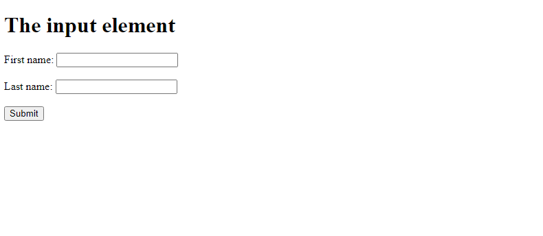

# Виджеты

Полезные страницы:

- [Поиск элементов](./ELEMENTS_SEARCHING.MD)
- [Редактирование элементов страницы](./EDIT.MD)
- [Клик по элементам страницы](./CLICK.MD)
- [Значение элементов страницы](./ELEMENT_VALUE.MD)

Сначала полезно прочитать про
дизайн-паттерн [Page Object](https://www.selenium.dev/documentation/en/guidelines_and_recommendations/page_object_models/)
.

Neptune предлагает свой вариант реализации этого шаблона проектирования, который сводится к типизации элементов на
странице, описанию их специфического поведения.

## Задача

Предположим, нужно написать тесты для следующей страницы



Ниже ее DOM модель

```html
<!DOCTYPE html>
<html>
<body>

<h1>The input element</h1>

<form action="/action_page.php">
    <label for="fname">First name:</label>
    <input type="text" id="fname" name="fname"><br><br>
    <label for="lname">Last name:</label>
    <input type="text" id="lname" name="lname"><br><br>
    <input type="submit" value="Submit">
</form>

</body>
</html>
```

Представим, что front end нашего приложения состоит из таких же элементов. Если не описывать виджеты, то тест, для
которого нужен front-end нашего приложения, может выглядеть так

```java
import static org.openqa.selenium.By.*;
import static ru.tinkoff.qa.neptune.selenium.SeleniumStepContext.inBrowser;
import static ru.tinkoff.qa.neptune.selenium.functions.searching.CommonElementCriteria.*;
import static ru.tinkoff.qa.neptune.selenium.functions.searching.SearchSupplier.*;

public class Tezzt {

    @Test
    public void tezzt() {
        inBrowser().presenceOf(webElement(tagName("h1"), "The input element")); //Дожидаемся что страница загрузилась
        //после чего начинаем 

        var field = inBrowser().find(webElement(tagName("input")) //Ищем поле ввода 
                //относительно которого располагается label с текстом `First name:`
                //в данном примере мы представляем его как вложенный элемент
                .criteria(nested(webElement(xpath("./preceding::label[1]"), "First name:"))));
        field.sendKeys("John"); //вводим текст

        var field = inBrowser().find(webElement(tagName("input")) //Ищем поле ввода 
                //относительно которого располагается label с текстом `Last name:`
                //в данном примере мы представляем его как вложенный элемент
                .criteria(nested(webElement(xpath("./preceding::label[1]"), "Last name:"))));
        field.sendKeys("Doe"); //вводим текст

        //Клик по кнопке "Submit"
        inBrowser().click(webElement(tagName("input")).criteria(attr("value", "Submit")));

        //Далее проверка нашего действия
    }
}
```

## Создание виджета

- Заголовок

```java
import org.openqa.selenium.support.FindBy;

import ru.tinkoff.qa.neptune.selenium.api.widget.HasValue;
import ru.tinkoff.qa.neptune.selenium.api.widget.Name;
import ru.tinkoff.qa.neptune.selenium.api.widget.Priority;
import ru.tinkoff.qa.neptune.selenium.api.widget.Widget;

@Name("Заголовок") //Данная аннотация влияет но то, как будет представлено строковое 
//значение данного объекта при вызове метода toString()
@Priority(priority = 2) //С помощью данной аннотации можно управлять очередью
//поиска однотипных элементов. 
//Если у данного класса выше приоритет,
//то механизм поиска первыми будет искать элементы данного класса.
//Если такие элементы найти не удалось, далее будут произведены попытки найти элементы
//классов с меньшим приоритетом.
//Максимальный приоритет = 1. Чем выше цифра, тем ниже приоритет.
@FindBy(tagNname = "h1") //Локатор, по которому можно найти элементы данного класса
//Относительно этого локатора ищутся элементы, из которых может состоять виджет.
public class Header
        extends Widget //Нужно унаследовать от этого класса
        implements HasValue<String> //Какое значение может предоставить элемент данного типа
{

    //Унаследованный конструктор
    protected Header(WebElement wrappedElement) {
        super(wrappedElement);
    }

    //Назначение таких элементов - простой вывод текста
    //Предположим, что этот текст - значение элемента, 
    //которое предоставляется виджетом
    @Override
    public String getValue() {
        return getWrappedElement().getText();
    }
}
```

- Текстовые поля

```java
import org.openqa.selenium.support.FindBy;

import ru.tinkoff.qa.neptune.selenium.api.widget.Editable;
import ru.tinkoff.qa.neptune.selenium.api.widget.HasValue;
import ru.tinkoff.qa.neptune.selenium.api.widget.Label;
import ru.tinkoff.qa.neptune.selenium.api.widget.Name;
import ru.tinkoff.qa.neptune.selenium.api.widget.Widget;

@Name("Текстовое поле ввода")
@FindBy(xpath = ".//input[@type='text']")
public class TextInput
        extends Widget
        implements HasValue<String>,
        Editable<String> //Означает, что эти элементы можно редактировать, 
        // в данном случае вводом строки
{

    @Label //Метка. Может быть использовано при поиске виджета с учетом текста. Подробности будут ниже.
    @FindBy(xpath = "./preceding::label[1]") //Элемент расположен относительно элемента,
    //или включается в элемент, 
    //локатор которого указан над классом
    private WebElement label;

    protected TextInput(WebElement wrappedElement) {
        super(wrappedElement);
    }

    @Override //Описываем механизм редактирования
    public void edit(String valueToSet) {
        var e = getWrappedElement();
        e.clear();
        e.sendKeys(charSequence);
    }

    @Override //Если поле заполнено, то можем считать,
    //что это значение, которое предоставляет виджет
    public String getValue() {
        return getWrappedElement().getAttribute("value");
    }
}
```

- Кнопки

```java
import org.openqa.selenium.support.FindBy;

import ru.tinkoff.qa.neptune.selenium.api.widget.Clickable;
import ru.tinkoff.qa.neptune.selenium.api.widget.Label;
import ru.tinkoff.qa.neptune.selenium.api.widget.Name;
import ru.tinkoff.qa.neptune.selenium.api.widget.Widget;

@Name("Кнопка")
@FindBy(xpath = ".//input[@type='submit']")
public class ButtonInput
        extends Widget
        implements Clickable //Означает, что эти элементы можно кликать
{

    protected ButtonInput(WebElement wrappedElement) {
        super(wrappedElement);
    }

    @Override //Описание того, как происходит клик
    public void click() {
        return getWrappedElement().click();
    }

    //Значение атрибута считаем меткой.
    @Label //Может быть использовано при поиске виджета с учетом текста. Подробности будут ниже.
    public String value() {
        return getAttribute("value");
    }
}
```

И в первом приближении наши действия на странице выглядят так:

```java
import static ru.tinkoff.qa.neptune.selenium.SeleniumStepContext.inBrowser;
import static ru.tinkoff.qa.neptune.selenium.functions.searching.CommonElementCriteria.*;
import static ru.tinkoff.qa.neptune.selenium.functions.searching.SearchSupplier.*;

public class Tezzt {

    @Test
    public void tezzt() {
        inBrowser().presenceOf(widget(Header.class, "The input element")); //Дожидаемся что страница загрузилась
        //после чего начинаем 

        inBrowser().edit(widget(TextInput.class, "First name:"), "John")
                .edit(widget(TextInput.class, "Last name:"), "Doe")
                .click(widget(ButtonInput.class, "Submit"));
        //Далее проверка нашего действия
    }
}
```

Вернемся к описанию текстового поля. Что если не только текстовые поля имеют метку с локатором `xpath = "./preceding::label[1]"`?
Как вариант, мы можем создать интерфейс

```java
import org.openqa.selenium.SearchContext;
import ru.tinkoff.qa.neptune.selenium.api.widget.Label;

import static org.openqa.selenium.By.*;

public interface HasOuterLabel extends SearchContext {

    @Label //Логика метки вынесена во внешний интерфейс
    default String outerLabel() {
        try {
          return findElement(xpath("./preceding::label[1]")).getText();
        }
        catch (NoSuchElementException e) {
            return "";//Если у виджета нет этой метки
        }
    }
}

```

и исправить ранее реализованный класс `TextInput`

```java
import ru.tinkoff.qa.neptune.selenium.api.widget.Editable;
import ru.tinkoff.qa.neptune.selenium.api.widget.HasValue;
import ru.tinkoff.qa.neptune.selenium.api.widget.Name;
import ru.tinkoff.qa.neptune.selenium.api.widget.Widget;

@Name("Текстовое поле ввода")
@FindBy(xpath = ".//input[@type='text']")
public class TextInput
        extends Widget
        implements HasValue<String>,
        Editable<String>, HasOuterLabel {
    protected TextInput(WebElement wrappedElement) {
        super(wrappedElement);
    }

    @Override 
    public void edit(String valueToSet) {
        var e = getWrappedElement();
        e.clear();
        e.sendKeys(charSequence);
    }

    @Override
    public String getValue() {
        return getWrappedElement().getAttribute("value");
    }
}
```

Есть [заранее заготовленные абстракции](./ELEMENTS_SEARCHING.MD#Список-абстрактных-классов-для-описания-виджетов,-которые-предоставляет-Neptune), 
позволяющие сгруппировать виджеты, от которых можно наследовать свои классы. Попробуем доработать наши виджеты, используя 
какие-либо из перечисленных классов, и исправить тест еще раз.

- Заголовки
  
```java
import org.openqa.selenium.support.FindBy;

import ru.tinkoff.qa.neptune.selenium.api.widget.Name;
import ru.tinkoff.qa.neptune.selenium.api.widget.Priority;
import ru.tinkoff.qa.neptune.selenium.api.widget.drafts.TextElement;

@Name("Заголовок")
@Priority(priority = 2) //С помощью данной аннотации можно управлять очередью
//поиска однотипных элементов.
//Теперь среди тех, которые могут быть описаны обобщающим классом TextElement
@FindBy(tagNname = "h1")
public class Header extends TextElement{

    protected Header(WebElement wrappedElement) {
        super(wrappedElement);
    }
}
```

- Текстовые поля
  
```java
import ru.tinkoff.qa.neptune.selenium.api.widget.Name;
import ru.tinkoff.qa.neptune.selenium.api.widget.drafts.TextField;
    
@Name("Текстовое поле ввода")
@FindBy(xpath = ".//input[@type='text']")
public class TextInput extends TextField implements HasOuterLabel {
    
   protected TextInput(WebElement wrappedElement) {
       super(wrappedElement);
   }
    
   @Override
   public void edit(List<CharSequence> toSet) {
       var e = getWrappedElement();
       e.clear();
       e.sendKeys(toSet.toArray(new CharSequence[] {}));
   }
    
   @Override
   public String getValue() {
       return getWrappedElement().getAttribute("value");
   }
}
```

- Кнопки
  
```java
import org.openqa.selenium.support.FindBy;

import ru.tinkoff.qa.neptune.selenium.api.widget.Label;
import ru.tinkoff.qa.neptune.selenium.api.widget.Name;
import ru.tinkoff.qa.neptune.selenium.api.widget.drafts.Button;
    
@Name("Кнопка")
@FindBy(xpath = ".//input[@type='submit']")
public class ButtonInput extends Button {
    
    protected ButtonInput(WebElement wrappedElement) {
        super(wrappedElement);
    }
    
    @Override //Описание того, как происходит клик
    public void click() {
        return getWrappedElement().click();
    }
        
    @Label 
    public String value() {
        return getAttribute("value");
    }
}
```

И теперь тест выглядит

```java
import static ru.tinkoff.qa.neptune.selenium.SeleniumStepContext.inBrowser;
import static ru.tinkoff.qa.neptune.selenium.functions.searching.CommonElementCriteria.*;
import static ru.tinkoff.qa.neptune.selenium.functions.searching.SearchSupplier.*;
    
public class Tezzt {
    
    @Test 
    public void tezzt() { 
        inBrowser().presenceOf(textElement("The input element")); //Дожидаемся что страница загрузилась
        //после чего начинаем 
    
        inBrowser().edit(textField("First name:"), "John")
                .edit(textField("Last name:"), "Doe")
                .click(button("Submit"));
            //Далее проверка нашего действия
    }
}
```

## Правила описания виджета

- у каждого виджета должен быть свой уникальный локатор, по которому он может быть однозначно найден на странице. Если
  один класс наследует другой и оба они не абстрактные, то у каждого из них должен быть свой уникальный локатор.

---

- аннотация `@Label` указывает на то, что является меткой виджета. Метка — это элемент, содержащий текст пояснения, для чего
  нужен тот или иной контрол. Так же эту роль может играть видимое значение того или иного атрибута. Могут быть и другие
  варианты. Поэтому аннотацией `@Label` могут быть отмечены:
    - объектные методы с пустой сигнатурой, которые возвращают `String`
    - объектные поля типа `org.openqa.selenium.WebElement`. Текст этих элементов буден использован как метка.

  Метка дополняет поиск элемента по тексту, создавая возможность найти его либо по текстовому содержимому, либо по
  тексту одной из меток.

---  

- Виджеты, которые могут быть использованы для клика, должны реализовывать
  интерфейс `ru.tinkoff.qa.neptune.selenium.api.widget.Clickable`. И тогда для них станут доступны действия
  вида `inBrowser.click(..)`

--- 

- Виджеты которые могут быть использованы для редактирования, должны реализовывать
  интерфейс `ru.tinkoff.qa.neptune.selenium.api.widget.Editable`. И тогда для них станут доступны действия
  вида `inBrowser.edit(..)`

---

- Виджеты которые могут быть использованы для получения каких-либо значений (введенного текста, каких-либо состояний,
  выводимого на экран текста и т.п.), должны реализовывать
  интерфейс `ru.tinkoff.qa.neptune.selenium.api.widget.HasValue`. И тогда для них станут доступны действия
  вида `inBrowser.valueOf(..)`

---

- Виджеты, которые могут развертывать и свертывать вложенный контент, должны реализовывать
  интерфейс `ru.tinkoff.qa.neptune.selenium.api.widget.Expandable`. И тогда для них станут доступны действия
  вида `inBrowser.expand(..)` и `inBrowser.collapse(..)`