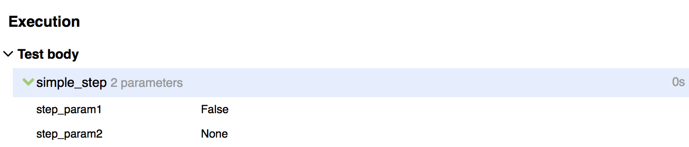

# Allure

Интеграция _Neptune_ и [Allure](https://docs.qameta.io/allure/)

```{eval-rst}
.. include:: allure_dependencies.rst
```

[API](https://tinkoff.github.io/neptune/allure.integration/index.html)

## Allure. Свойства

Перечисленные ниже свойства дополняют [стандартный набор](./../quick_start/settings/index.md)

### MASKED_PARAMETERS

Данное свойство используется, чтобы замаскировать значения секъюрных параметров шагов. 
Значение свойства задается строкой, разделенной запятыми. Здесь могут быть указаны как полные названия 
параметров, так и фрагменты названий/регулярные выражения.



```properties
#Значение свойства указывается так
MASKED_PARAMETERS=step_param1,step_param2
```

```java
import java.util.List;

import ru.tinkoff.qa.neptune.core.api.data.format.DataTransformer;

import static ru.tinkoff.qa.neptune.allure.properties
    .MaskedParametersProperty.MASKED_PARAMETERS;

public class SomeClass {

    public void someVoid() {
        //пример доступа до значения свойства
        List<String> toBeMasked = SMASKED_PARAMETERS.get();
    }
}
```