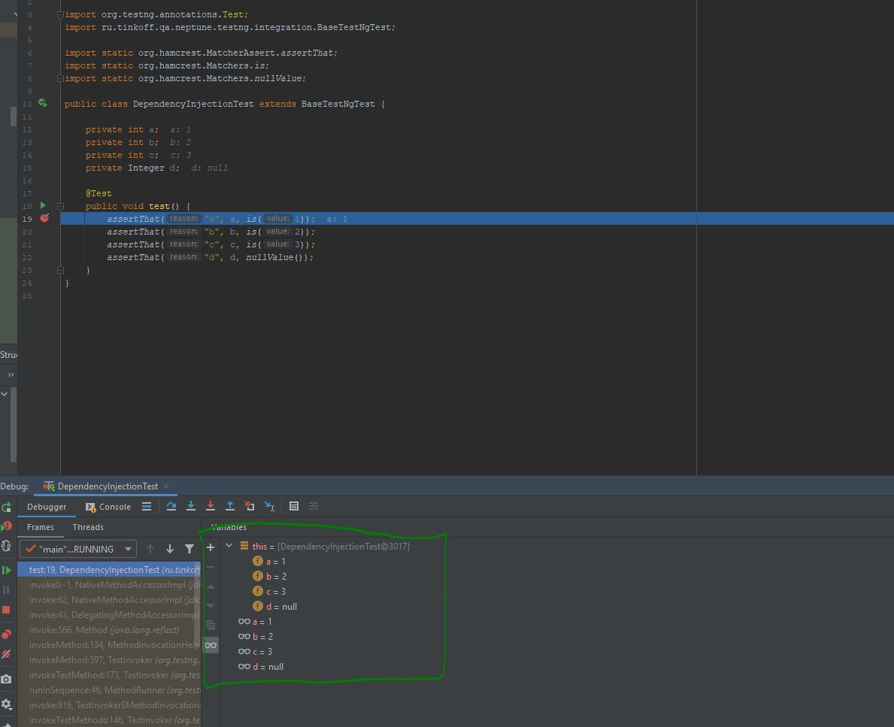

# Интеграция с TestNG

Данный модуль предназначен для интеграции Neptune и TestNG

## Maven

В pom.xml

```xml
    <dependencies>
        <dependency>
            <groupId>ru.tinkoff.qa.neptune</groupId>
            <artifactId>testng.integration</artifactId>
            <version>${LATEST_RELEASE_OR_BETA_VERSION}</version>
            <scope>test</scope>
        </dependency>
    </dependencies>
```

## Gradle

В build.gradle

```groovy
    dependencies {
        testCompile group: 'ru.tinkoff.qa.neptune', name: 'testng.integration', version: LATEST_RELEASE_OR_BETA_VERSION    
    }
```


## Пишем первый тест

Класс, описывающий тест, должен наследоваться от `BaseTestNgTest`

```java
import org.testng.annotations.Test;
import ru.tinkoff.qa.neptune.testng.integration.BaseTestNgTest;

public class MyTest extends BaseTestNgTest {
    
    @Test
    public test() {
      //some checks
    }
}
```

## Настройки
<details>
  <summary>Нажми, чтобы прочесть</summary>

[Подробнее о механизме настроек](./../../../core.api/doc/rus/SETTINGS.MD)

Подробнее [о контекстах](./../../../core.api/doc/rus/IDEA.MD#Контекст) и об их [обновлении](./../../../core.api/doc/rus/REFRESHING_STOPPING.MD#Обновление)

Необходимо определиться, перед каким методами следует обновить контекст (перегрузить/перезапустить браузер, проверить соединение с базами данных, и если
что-то отвалилось - создать новое, и т.п). Типы этих методов описываются перечислением `ru.tinkoff.qa.neptune.testng.integration.properties.RefreshEachTimeBefore`:
- `SUITE_STARTING` перед методами, отмеченными `@BeforeSuite`
- `TEST_STARTING` перед методами, отмеченными `@BeforeTest`
- `CLASS_STARTING` перед методами, отмеченными `@BeforeClass`
- `GROUP_STARTING` перед методами, отмеченными `@BeforeGroups`
- `BEFORE_METHOD_STARTING` перед методами, отмеченными `@BeforeMethod`
- `METHOD_STARTING` перед методами, отмеченными `@Test`

Значение свойства/переменной окружения `TESTNG_REFRESH_BEFORE` должно быть равно одному из перечисленных выше элементов, или оно может включать в себя несколько 
из перечисленных выше элементов (указывается как строка, в которой элементы разделены запятыми). Свойство и его значение должны быть указаны в `neptune.global.properties` 
или в `neptune.properties`, или как свойство/переменная окружения и его значение в той среде, в которой запускаются тесты.

```properties
# обновление происходит перед первым в очереди вызова (до ближайшего @Test-метода) методом
# с аннотацией @BeforeClass
TESTNG_REFRESH_BEFORE=CLASS_STARTING
```

```properties
# обновление происходит перед первым в очереди вызова (до ближайшего @Test-метода) методом
# с аннотацией @BeforeClass или @BeforeMethod. Если перед @Test-методом методы с указанными аннотациями
# не вызывались, то обновление произойдет непосредственно перед началом КАЖДОГО теста В рамках класса.
TESTNG_REFRESH_BEFORE=CLASS_STARTING,BEFORE_METHOD_STARTING,METHOD_STARTING
```

При этом учитывается иерархия методов TestNG. Порядок приведен ниже:

1. `@BeforeSuite`

2. `@BeforeTest`

3. `@BeforeClass`

4. `@BeforeGroups`

5. `@BeforeMethod`

6. `@Test`

Предположим, мы имеем настройку
```properties
TESTNG_REFRESH_BEFORE=SUITE_STARTING,TEST_STARTING,CLASS_STARTING,GROUP_STARTING,BEFORE_METHOD_STARTING,METHOD_STARTING
```

Предположим, у нас xml suite из одного класса. 

```xml
<suite name="Some suite">

    <test name="Some test">
        <classes>
            <class name="org.my.pack.TezztClazz"/>
        </classes>
    </test>
</suite>
```

Рассмотрим, в какой момент будет происходить обновление контекстов на примере этого класса.

```java
package org.my.pack;

public class TezztClazz extends BaseTestNgTest {

    @BeforeSuite //Обновление используемых контекстов произойдет здесь
    public /*static*/ void beforeSuite() {
       //что происходит перед стартом всего набора тестов "Some suite"
    }

    //Обновление используемых контекстов могло бы произойти здесь
    @BeforeSuite //если бы не было метода выше
    public /*static*/ void beforeSuite2() {
      //что происходит перед стартом всего набора тестов "Some suite"
    }

    //Обновление используемых контекстов могло бы произойти здесь
    @BeforeTest //если бы не было методов выше
    public /*static*/ void beforeTest() {
       //что происходит перед стартом всего набора тестов "Some test"
    }
   
    //Обновление используемых контекстов могло бы произойти здесь
    @BeforeTest //если бы не было методов выше
    public /*static*/ void beforeTest2() {
      //что происходит перед стартом всего набора тестов "Some test"
    }    

    //Обновление используемых контекстов могло бы произойти здесь
    @BeforeClass //если бы не было методов выше
    public /*static*/ void beforeClass() {
       //что происходит перед стартом всего набора тестов класса TezztClazz
    }

    //Обновление используемых контекстов могло бы произойти здесь
    @BeforeClass //если бы не было методов выше
    public /*static*/ void beforeClass2() {
      //что происходит перед стартом всего набора тестов класса TezztClazz
    } 

    //Обновление используемых контекстов могло бы произойти здесь
    @BeforeGroups("someGroup1")  //если бы не было методов выше
    public /*static*/ void beforeGroups() {
       //что происходит перед стартом группы 'someGroup1' тестовых методов
    }

    //Обновление используемых контекстов могло бы произойти здесь
    @BeforeGroups("someGroup2") //если бы не было методов выше (не считая beforeGroups). 
    public /*static*/ void beforeGroups2() {
      //что происходит перед стартом группы 'someGroup2' тестовых методов
    } 
    
    //Обновление используемых контекстов могло бы произойти здесь
    @BeforeMethod  //если бы не было методов выше
    public /*static*/ void beforeMethod() {
       //что происходит перед стартом каждого тестового метода
    }

    //Обновление используемых контекстов могло бы произойти здесь
    @BeforeMethod   //если бы не было методов выше
    public /*static*/ void beforeMethod2() {
      //что происходит перед стартом каждого тестового метода
    }

    //Если бы выше не было @Before*-методов
    //используемые контексты обновились бы перед эти методом
    @Test(groups = {"someGroup1", "someGroup2"})
    public void test1() {
    
    }

    //Если бы выше не было @Before*-методов
    //используемые контексты обновились бы перед эти методом
    @Test(groups = "someGroup1")
    public void test2() {
        
    }

    //Если бы выше не было @Before*-методов
    //используемые контексты обновились бы перед эти методом
    @Test(groups = {"someGroup1", "someGroup2"})
    public void test3() {
    
    }

    //Если бы выше не было @Before*-методов
    //используемые контексты обновились бы перед эти методом
    @Test(groups = "someGroup2")
    public void test4() {
        
    }

    //и т.д.
}
``` 

### Стоит иметь в виду

- Если все наборы тестов (xml suites) выполняются в один поток, то достаточно
```properties
TESTNG_REFRESH_BEFORE=SUITE_STARTING,TEST_STARTING,CLASS_STARTING,GROUP_STARTING
# или один из вариантов, по условиям и обстоятельствам
```

- Если среди наборов тестов (xml suites) есть те, в которых используется много-поточность на уровне тестов, классов или тест-инстансов, то 
можно добавить
```properties
TESTNG_REFRESH_BEFORE=TEST_STARTING,CLASS_STARTING,GROUP_STARTING
# или один из вариантов, по условиям и обстоятельствам
```

- Если среди наборов тестов (xml suites) есть те, в которых используется много-поточность на уровне выполняемых методов, то 
можно добавить
```properties
TESTNG_REFRESH_BEFORE=BEFORE_METHOD_STARTING,METHOD_STARTING
# или один из вариантов, по условиям и обстоятельствам 
```

</details>

## Внедрение зависимостей
<details>
  <summary>Нажми, чтобы прочесть</summary>

Для инициализации полей, принадлежащих тестовому классу, вполне допустимо использовать методы, отмеченные аннотациями `@Before*`. Но что если из 
раза в раз приходится инициализировать схожий набор полей одним и тем же способом? Один из выходов - наследование тестовых классов друг от друга.
Но иногда оно приводит к неудобствам вследствие потери гибкости из-за необходимости следовать в дальнейшем правилам наследования Java.  

Альтернативой может служить механизм [внедрения зависимостей](./../../../core.api/doc/rus/DEPENDENCY_INJECTION.MD), реализованный Neptune. 

Представим ситуацию
```java
import org.testng.annotations.Test;
import ru.tinkoff.qa.neptune.testng.integration.BaseTestNgTest;

import static org.hamcrest.MatcherAssert.assertThat;
import static org.hamcrest.Matchers.is;
import static org.hamcrest.Matchers.nullValue;

public class DependencyInjectionTest extends BaseTestNgTest {

    private int a; //во всех тестах поле 'a' должно быть равно 1
    private int b;  //во всех тестах поле 'b' должно быть равно 2
    private int c;  //во всех тестах поле 'c' должно быть равно 3
    private Integer d;

    @Test
    public void test() {
        assertThat("a", a, is(1));
        assertThat("b", b, is(2));
        assertThat("c", c, is(3));
        assertThat("d", d, nullValue());
    }
}
``` 

Достаточно просто написать 

```java
import java.lang.reflect.Field;

public class TestDependencyInjector implements DependencyInjector {

    @Override
    public boolean toSet(Field field) {
        var name = field.getName();
        return name.equals("a") || name.equals("b") || name.equals("c");
    }

    @Override
    public Object getValueToSet(Field field) {
        var name = field.getName();
        if (name.equals("a")) {
            return 1;
        }

        if (name.equals("b")) {
            return 2;
        }

        return 3;
    }
}
```

И ничего больше делать не надо. Запускаем тест и видим



## Стоит иметь в виду

- описанный механизм внедрения зависимостей не работает со статическими, финальными и уже заполненными на момент начала его работы полями

- нужно ознакомиться с документацией используемых модулей Neptune:

[Http модуль. Мэппинг сервисов. Внедрение зависимостей](./../../../http.api/doc/rus/MAPPING.MD#Внедрение-зависимостей)

</details>

